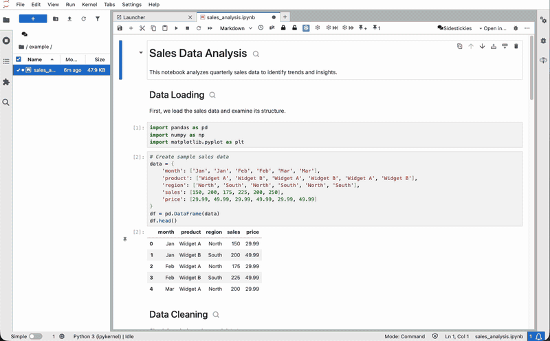
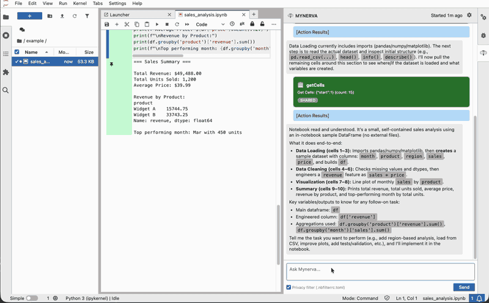

# jupyter-mynerva

<p align="center">
  
</p>

[](https://github.com/yacchin1205/jupyter-mynerva/actions/workflows/build.yml)
[](https://mybinder.org/v2/gh/yacchin1205/jupyter-mynerva/main?urlpath=lab)

A JupyterLab extension that provides an LLM-powered assistant with deep understanding of notebook structure.

## Why "Mynerva"?

The name derives from **Minerva**, the Roman goddess of wisdom. The spelling reflects **"My + Minerva"**—a personalized, notebook-centric intelligence.

As Jupyter reinterprets Jupiter, Mynerva reinterprets Minerva as an AI companion for computational notebooks.

## Concept: The Story Travels with the Code

A notebook is a computational narrative. Headings, code, and outputs form a coherent story. Existing AI assistants see only isolated snippets—the surrounding context gets lost.

jupyter-mynerva keeps the story intact. Section structure, explanatory markdown, and outputs travel together as logical units.

The LLM actively explores—requesting the table of contents, navigating sections, examining outputs. It pulls the context it needs, rather than waiting for users to push fragments.

## Demo

### Exploring a Notebook



### Adding Code



## Architecture

```
┌─────────────────────────────────────────────────────────┐
│ JupyterLab                                              │
│  ┌─────────────────────┐  ┌──────────────────────────┐  │
│  │  Active Notebook    │  │  Mynerva Panel (React)   │  │
│  │                     │  │  - Chat UI               │  │
│  │                     │  │  - Action confirmation   │  │
│  └─────────────────────┘  └────────────┬─────────────┘  │
│                                        │                │
│  ┌─────────────────────────────────────▼─────────────┐  │
│  │  Context Engine (TypeScript)                      │  │
│  │  - ToC / Section / Cell / Output extraction       │  │
│  │  - Notebook mutation handlers                     │  │
│  └─────────────────────────────────────┬─────────────┘  │
└────────────────────────────────────────┼────────────────┘
                                         │ REST
┌────────────────────────────────────────▼────────────────┐
│  Server Extension (Python)                              │
│  - LLM proxy (OpenAI / Anthropic)                       │
│  - Session storage (.mynerva files)                     │
└─────────────────────────────────────────────────────────┘
```

**Mynerva Panel**: Chat interface in the right sidebar. Operates on the currently open notebook.

**Context Engine**: Extracts notebook structure—ToC from headings, sections as markdown+code units, outputs with type awareness. TypeScript implementation (port of nbq logic).

**Server Extension**: Proxies LLM API (no streaming). Sessions persisted in `.mynerva/` directory.

### Design Decisions

| Topic               | Decision                                                                                           |
| ------------------- | -------------------------------------------------------------------------------------------------- |
| Context extraction  | TypeScript reimplementation of nbq                                                                 |
| Privacy filter      | TypeScript, reads `.nbfilterrc.toml` for consistency with nbfilter                                 |
| Session storage     | `.mynerva/sessions/*.mnchat` files, auto-named (timestamp + ID)                                    |
| Session lifecycle   | Independent of active notebook; explicit switch only                                               |
| Streaming           | Not supported                                                                                      |
| File access         | Jupyter root directory only                                                                        |
| Action confirmation | Batch confirmation supported; per-notebook auto-approval available                                 |
| Mutation validation | Optimistic locking via `_hash`; must read before write                                             |
| Error handling      | API failure: retry with limit (3). Hash mismatch / user rejection: feedback to LLM, no retry count |
| LLM providers       | OpenAI, Anthropic                                                                                  |

### UI

**Panel (right sidebar):**

- Session selector (dropdown + new)
- Chat messages
- Query preview (inline, with filter option)
- Mutate preview (modal, diff view)
- Trust mode toggle

**Settings (gear icon in panel header):**

- Provider selection
- Model selection
- API key (Fernet-encrypted if secret key present)

## Actions

LLM communicates through structured actions. All actions require user confirmation.

Query actions show a preview before sending to LLM. Users can choose to apply privacy filters (nbfilter-style masking of IPs, domains, etc.) or send raw content.

### Query: Active Notebook

| Action       | Parameters        | Description                           |
| ------------ | ----------------- | ------------------------------------- |
| `getToc`     | —                 | Heading structure of current notebook |
| `getSection` | `query`           | Cells under matched heading           |
| `getCells`   | `query`, `count?` | Cell range from matched position      |
| `getOutput`  | `query`           | Output of matched cell                |

### Query: Other Files

| Action               | Parameters                | Description                             |
| -------------------- | ------------------------- | --------------------------------------- |
| `listNotebookFiles`  | `path?`                   | List notebooks in directory             |
| `getTocFromFile`     | `path`                    | Heading structure of specified notebook |
| `getSectionFromFile` | `path`, `query`           | Cells under matched heading             |
| `getCellsFromFile`   | `path`, `query`, `count?` | Cell range from matched position        |
| `getOutputFromFile`  | `path`, `query`           | Output of matched cell                  |

### Query Syntax

```json
{ "match": "## Data" }    // regex against heading/content
{ "contains": "pandas" }  // substring match
{ "start": 5 }            // cell index
{ "id": "abc123" }        // cell ID
```

### Mutate: Active Notebook

| Action        | Parameters                        | Description                     |
| ------------- | --------------------------------- | ------------------------------- |
| `insertCell`  | `position`, `cellType`, `content` | Insert above/below current cell |
| `replaceCell` | `query`, `content`                | Replace cell content            |
| `deleteCell`  | `query`                           | Delete cell                     |
| `runCell`     | `query?`                          | Execute cell (default: current) |

### Help (no confirmation required)

| Action     | Parameters | Description                                       |
| ---------- | ---------- | ------------------------------------------------- |
| `listHelp` | —          | Show available actions (re-display system prompt) |
| `help`     | `action`   | Show details for specific action                  |

### Action Auto-Approval

Users can choose "Always allow for this notebook" when approving an action. Auto-approval is scoped to:

- **Same notebook** (the currently open tab)
- **Same action type** (or broader for Query actions)

**Query action hierarchy:**

Query actions have a granularity hierarchy. Approving finer-grained actions automatically approves coarser-grained ones:

| Approved Action | Also Approved                      |
| --------------- | ---------------------------------- |
| `getOutput`     | `getCells`, `getSection`, `getToc` |
| `getCells`      | `getSection`, `getToc`             |
| `getSection`    | `getToc`                           |
| `getToc`        | (none)                             |

Rationale: If the user trusts output-level access, code and structure access (which may expose less sensitive detail) is implicitly trusted.

**Mutate actions**: Each type (`insertCell`, `updateCell`, `deleteCell`, `runCell`) requires separate approval. No hierarchy applies.

Auto-approval is cleared when switching notebooks or closing the panel.

## System Prompt

LLM receives the following initial instruction:

```
You are Mynerva, a Jupyter notebook assistant.
- Always respond with JSON only. No text before or after.
- JSON structure:
  {
    "messages": [{ "role": "assistant", "content": "explanation" }],
    "actions": [{ "type": "...", "query": {...}, ... }]
  }
- "messages": natural language responses to user
- "actions": structured operations (can be empty array)

Available actions:

Query (active notebook):
  - getToc: {}
  - getSection: { query }
  - getCells: { query, count? }
  - getOutput: { query }

Query (other files):
  - listNotebookFiles: { path? }
  - getTocFromFile: { path }
  - getSectionFromFile: { path, query }
  - getCellsFromFile: { path, query, count? }
  - getOutputFromFile: { path, query }

Mutate (requires _hash from prior read):
  - insertCell: { position, cellType, content }
  - replaceCell: { query, content, _hash }
  - deleteCell: { query, _hash }
  - runCell: { query? }

Query syntax: { match: "regex" } | { contains: "text" } | { start: N } | { id: "cellId" }

Help:
  - listHelp: {} - show this prompt again
  - help: { action } - show details for specific action
```

## Configuration

### Secret Key

`MYNERVA_SECRET_KEY` (env) or `c.Mynerva.secret_key` (traitlets)

Fernet key for encrypting API keys. If absent, Settings UI shows warning; keys stored unencrypted (not recommended).

### Default Configuration (Environment Variables)

Administrators can provide default LLM settings via environment variables. Users can choose to use these defaults or configure their own.

| Variable                    | Description                                                |
| --------------------------- | ---------------------------------------------------------- |
| `MYNERVA_OPENAI_API_KEY`    | Default OpenAI API key                                     |
| `MYNERVA_ANTHROPIC_API_KEY` | Default Anthropic API key                                  |
| `MYNERVA_DEFAULT_PROVIDER`  | Default provider (`openai` or `anthropic`)                 |
| `MYNERVA_DEFAULT_MODEL`     | Default model name (optional, uses first model if not set) |

**Provider auto-detection:**

- If only one API key is set, that provider is automatically selected
- If both API keys are set, `MYNERVA_DEFAULT_PROVIDER` is required

**Auto-initialization:** If `~/.mynerva/config.json` doesn't exist and defaults are available, it's automatically created with `useDefault: true`.

**Security note:** API key environment variables are deleted after loading to prevent exposure in notebook cells.

### User Configuration

Users can configure their own settings via the panel settings UI:

- Provider selection
- Model selection
- API key (encrypted if `MYNERVA_SECRET_KEY` is set)

If default configuration is available, users can choose "Use default settings" instead of providing their own API key.

## Requirements

- JupyterLab >= 4.0.0

## Install

```bash
pip install jupyter_mynerva
```

## Contributing

### Development install

```bash
# Clone the repo to your local environment
# Change directory to the jupyter_mynerva directory

# Set up a virtual environment and install package in development mode
python -m venv .venv
source .venv/bin/activate
pip install --editable "."

# Link your development version of the extension with JupyterLab
jupyter labextension develop . --overwrite
# Server extension must be manually installed in develop mode
jupyter server extension enable jupyter_mynerva

# Rebuild extension Typescript source after making changes
jlpm build
```

You can watch the source directory and run JupyterLab at the same time in different terminals to watch for changes in the extension's source and automatically rebuild the extension.

```bash
# Watch the source directory in one terminal, automatically rebuilding when needed
jlpm watch
# Run JupyterLab in another terminal
jupyter lab
```

### Running with encryption

Generate a Fernet key for API key encryption:

```bash
python -c "from cryptography.fernet import Fernet; print(Fernet.generate_key().decode())"
```

Run JupyterLab with the secret key:

```bash
MYNERVA_SECRET_KEY=your-generated-key jupyter lab
```

Without `MYNERVA_SECRET_KEY`, API keys are stored unencrypted in `~/.mynerva/config.json`.

### Running with default API key

Provide a default API key for users:

```bash
MYNERVA_OPENAI_API_KEY=sk-... MYNERVA_DEFAULT_PROVIDER=openai MYNERVA_DEFAULT_MODEL=gpt-5.2 jupyter lab
```

Users will see a "Use default settings" option in the settings UI.

### Packaging the extension

See [RELEASE](RELEASE.md)

## References

- [nbq](https://github.com/yacchin1205/nbq) - CLI for querying notebook structure (ToC, sections, cells, outputs)
- [nbfilter](https://github.com/yacchin1205/nbfilter) - Privacy filter for notebooks (masks IPs, domains, etc.)
